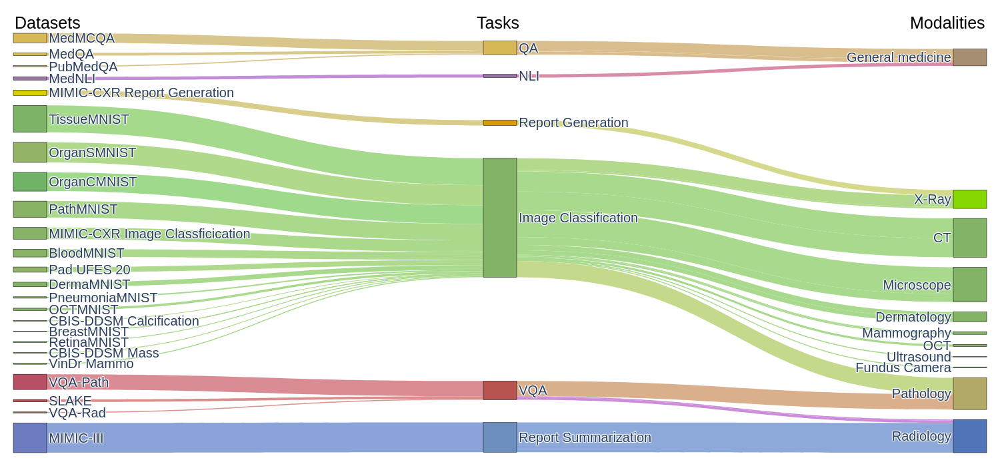

# MultiMedEval


MultiMedEval is a library to evaluate the performance of Vision-Language Models (VLM) on medical domain tasks. The goal is to have a set of benchmark with a unified evaluation scheme to facilitate the development and comparison of medical VLM.
We include 24 tasks representing 10 different imaging modalities and some text-only tasks.

   


## Tasks

<details>
  <summary>Question Answering</summary>


| Task                           | Description                                                                                                        | Modality       | Size
|--------------------------------|--------------------------------------------------------------------------------------------------------------------|----------------|----------
| MedQA                          | Multiple choice questions on general medical knowledge                                                             | General medicine| 1273
| PubMedQA                       | Yes/no/maybe questions based on PubMed paper abstracts                                                             | General medicine| 500
| MedMCQA                        | Multiple choice questions on general medical knowledge                                                             | General medicine| 4183

</details>

</br>

<details>
  <summary>Visual Question Answering</summary>

| Task                           | Description                                                                                                        | Modality       | Size
|--------------------------------|--------------------------------------------------------------------------------------------------------------------|----------------|----------
| VQA-RAD                        | Open ended questions on radiology images                                                                           | X-ray          | 451
| Path-VQA                       | Open ended questions on pathology images                                                                           | Pathology      | 6719
| SLAKE                          | Open ended questions on radiology images                                                                           | X-ray          | 1061

</details>

</br>

<details>
  <summary>Report Comparison</summary>

| Task                           | Description                                                                                                        | Modality       | Size
|--------------------------------|--------------------------------------------------------------------------------------------------------------------|----------------|----------
| MIMIC-CXR-ReportGeneration     | Generation of finding sections of radiology reports based on the radiology images                                  | Chest X-ray    | 2347
| MIMIC-III                      | Summarization of radiology reports                                                                                 | Text           | 13054

</details>

</br>

<details>
  <summary>Natural Language Inference</summary>

| Task                           | Description                                                                                                        | Modality       | Size
|--------------------------------|--------------------------------------------------------------------------------------------------------------------|----------------|----------
| MedNLI                         | Natural Language Inference on medical sentences.                                                                   | General medicine| 1422

</details>

</br>

<details>
  <summary>Image Classification</summary>

| Task                           | Description                                                                                                        | Modality       | Size
|--------------------------------|--------------------------------------------------------------------------------------------------------------------|----------------|----------
| MIMIC-CXR-ImageClassification  | Classification of radiology images into 5 diseases                                                                 | Chest X-ray    | 5159
| VinDr-Mammo                    | Classification of mammography images into 5 BIRADS levels                                                          | Mammography    | 429
| Pad-UFES-20                    | Classification of skin lesion images into 7 diseases                                                               | Dermatology    | 2298
| CBIS-DDSM-Mass                 | Classification of masses in mammography images into "benign", "malignant" or "benign without callback"             | Mammography    | 378
| CBIS-DDSM-Calcification        | Classification of calcification in mammography images into "benign", "malignant" or "benign without callback"      | Mammography    | 326
| MNIST-Oct                      | Image classification of Optical coherence tomography of the retina                                                 | OCT            | 1000
| MNIST-Path                     | Image classification of pathology image                                                                            | Pathology      | 7180
| MNIST-Blood                    | Image classification of blood cell seen through a microscope                                                       | Microscopy     | 3421
| MNIST-Breast                   | Image classification of mammography                                                                                | Mammography    | 156
| MNIST-Derma                    | Image classification of skin defect images                                                                        | Dermatology    | 2005
| MNIST-OrganC                   | Image classification of abdominal CT scan                                                                          | CT             | 8216
| MNIST-OrganS                   | Image classification of abdominal CT scan                                                                          | CT             | 8827
| MNIST-Pneumonia                | Image classification of chest X-Rays                                                                               | X-Ray          | 624
| MNIST-Retina                   | Image classification of the retina taken with a fondus camera                                                      | Fondus Camera  | 400
| MNIST-Tissue                   | Image classification of kidney cortex seen through a microscope                                                    | Microscopy     | 12820

</details>

</br>

<p align="center">
    
    <br>
    <em>Representation of the modalities, tasks and datasets in MultiMedEval</em>
</p>


## Setup

To install the library, you can use `pip`

```console
pip install multimedeval
```

To run the benchmark on your model, you first need to create an instance of the `MultiMedEval` class.
```python
from multimedeval import MultiMedEval, SetupParams, EvalParams
engine = MultiMedEval()
```

You then need to call the `setup` function of the `engine`. This will download the datasets if needed and prepare them for evaluation. You can specify where to store the data and which datasets you want to download.

```python
setupParams = SetupParams(MedQA_dir="data/")
tasksReady = engine.setup(setupParams=setupParams)
```

Here we initialize the `SetupParams` dataclass with only the path for the MedQA dataset. If you omit to pass a directory for some of the datasets, they will be skipped during the evaluation. During the setup process, the script will need a Physionet username and password to download "VinDr-Mammo", "MIMIC-CXR" and "MIMIC-III". You also need to setup Kaggle on your machine before running the setup as the "CBIS-DDSM" is hosted on Kaggle. At the end of the setup process, you will see a summary of which tasks are ready and which didn't run properly and the function will return a summary in the form of a dictionary.

## Usage

### Implement the Batcher

The user must implement one Callable: `batcher`. It takes a batch of input and must return the answer.
The batch is a list of inputs.
Each input is a tuple of:
* a prompt in the form of a Hugginface-style conversation between a user and an assistant.
* a list of Pillow images. The number of images matches the number of  tokens in the prompt and are ordered.

```python
[
    (
        [
            {"role": "user", "content": "This is a question with an image ."}, 
            {"role": "assistant", "content": "This is the answer."},
            {"role": "user", "content": "This is a question with an image ."}, 
        ], 
        [PIL.Image(), PIL.Image()]
    ),
    (
        [
            {"role": "user", "content": "This is a question without images."},
            {"role": "assistant", "content": "This is the answer."},
            {"role": "user", "content": "This is a question without images."}, 
        ], 
        []
    ),

]
```

Here is an example of a `batcher` without any logic:
```python
def batcher(prompts) -> list[str]:
    return ["Answer" for _ in prompts]
``` 

A function is the simplest example of a Callable but the batcher can also be implemented as a Callable class (i.e. a class implementing the `__call__` method). Doing it this way allows to initialize the model in the `__init__` function of the class. We give an example for the Mistral model (a language-only model).

```python
class batcherMistral:
    def __init__(self) -> None:
        self.model: MistralModel = AutoModelForCausalLM.from_pretrained("mistralai/Mistral-7B-Instruct-v0.1")
        self.tokenizer = AutoTokenizer.from_pretrained("mistralai/Mistral-7B-Instruct-v0.1")
        self.tokenizer.pad_token = self.tokenizer.eos_token

    def __call__(self, prompts):
        model_inputs = [self.tokenizer.apply_chat_template(messages[0], return_tensors="pt", tokenize=False) for messages in prompts]
        model_inputs = self.tokenizer(model_inputs, padding="max_length", truncation=True, max_length=1024, return_tensors="pt")

        generated_ids = self.model.generate(**model_inputs, max_new_tokens=200, do_sample=True, pad_token_id=self.tokenizer.pad_token_id)

        # Remove the first 1024 tokens (prompt)
        generated_ids = generated_ids[:, model_inputs["input_ids"].shape[1] :]

        answers = self.tokenizer.batch_decode(generated_ids, skip_special_tokens=True)
        return answers
```

### Run the benchmark
To run the benchmark, call the `eval` method of the `MultiMedEval` class with the list of tasks to benchmark on, the batcher to ealuate and the evaluation parameters. If the list is empty, all the tasks will be benchmarked. 

```python
evalParams = EvalParams(batch_size=128)
results = engine.eval(["MedQA", "VQA-RAD"], batcher, evalParams=evalParams)
```

## MultiMedEval parameters

The `SetupParams` class takes a path for each dataset:
* MedQA_dir: will be used in Huggingface's `load_dataset` as cache_dir
* PubMedQA_dir: will be used in Huggingface's `load_dataset` as cache_dir
* MedMCQA_dir: will be used in Huggingface's `load_dataset` as cache_dir
* VQA_RAD_dir: will be used in Huggingface's `load_dataset` as cache_dir
* Path_VQA_dir: will be used in Huggingface's `load_dataset` as cache_dir
* SLAKE_dir: the dataset is currently hosted on Google Drive which can be an issue on some systems.
* MIMIC_III_dir: path for the (physionet) MIMIC-III dataset.
* MedNLI_dir: will be used in Huggingface's `load_dataset` as cache_dir
* MIMIC_CXR_dir: path for the (physionet) MIMIC-CXR dataset.
* VinDr_Mammo_dir: path for the (physionet) VinDr-Mammo dataset.
* Pad_UFES_20_dir
* CBIS_DDSM_dir: dataset hosted on Kaggle. Kaggle must be set up on the system (see [this](https://www.kaggle.com/docs/api#getting-started-installation-&-authentication))
* MNIST_Oct_dir
* MNIST_Path_dir
* MNIST_Blood_dir
* MNIST_Breast_dir
* MNIST_Derma_dir
* MNIST_OrganC_dir
* MNIST_OrganS_dir
* MNIST_Pneumonia_dir
* MNIST_Retina_dir
* MNIST_Tissue_dir
* CheXBert_dir: path for the CheXBert model checkpoint
* physionet_username: physionet username to download MIMIC and VinDr-Mammo
* physionet_password: password for the physionet account


The `EvalParams` class takes the following arguments:
* batch_size: The size of the batches sent to the user's batcher Callable. 
* run_name: The name to use for the folder where the output will be stored.
* fewshot: A boolean indicating whether the evaluation is few-shot.
* num_workers: The number of workers for the dataloader.
* device: The device to run the evaluation on.
* tensorBoardWriter: The tensorboard writer to use for logging.
* tensorboardStep: The global step for logging to tensorboard.


## Additional tasks

To add a new task to the list of already implemented ones, create a folder named `MultiMedEvalAdditionalDatasets` and a subfolder with the name of your dataset.

Inside your dataset folder, create a `json` file that follows the following template for a VQA dataset:

```json
{
    "taskType": "VQA",
    "modality": "Radiology",
    "samples": [
        {"question": "Question 1", "answer": "Answer 1", "images": ["image1.png", "image2.png"]},
        {"question": "Question 2", "answer": "Answer 2", "images": ["image1.png"]},
    ]
}
```

And for a QA dataset:

```json
{
    "taskType": "QA",
    "modality": "Pathology",
    "samples": [
        {"question": "Question 1", "answer": "Answer 1", "options": ["Option 1", "Option 2"], "images": ["image1.png", "image2.png"]},
        {"question": "Question 2", "answer": "Answer 2", "options": ["Option 1", "Option 2"], "images": ["image1.png"]},
    ]
}
```

Note that in both cases the `images` key is optional. If the `taskType` is VQA, the metrics computed will be BLEU-1, accuracy for closed and open questions, recall and recall for open questions as well as F1. For the QA `taskType`, the tool will report the accuracy (by comparing the answer to every option using BLEU).


## Reference

```
@misc{royer2024multimedeval,
      title={MultiMedEval: A Benchmark and a Toolkit for Evaluating Medical Vision-Language Models}, 
      author={Corentin Royer and Bjoern Menze and Anjany Sekuboyina},
      year={2024},
      eprint={2402.09262},
      archivePrefix={arXiv},
      primaryClass={cs.CV}
}
```

