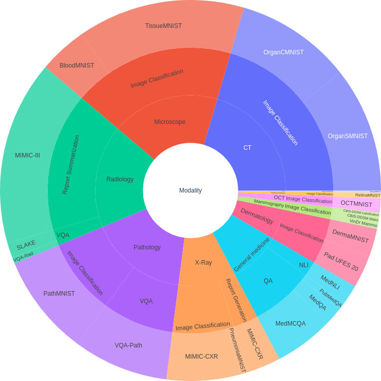

# MultiMedBench


MultiMedBench is a library to evaluate the performance of Vision-Language Models (VLM) on medical domain tasks. The goal is to have a set of benchmark with a unified evaluation scheme to facilitate the development and comparison of medical VLM.
We include 12 tasks representing a range of different imaging modalities.


## Tasks

| Task                           | Description                                                                                       | Modality       | Size
|--------------------------------|---------------------------------------------------------------------------------------------------|----------------|----------
| MedQA                          | Multiple choice questions on general medical knowledge                                            | Text           |
| PubMedQA                       | Yes/no/maybe questions based on PubMed paper abstracts                                            | Text           |
| MedMCQA                        | Multiple choice questions on general medical knowledge                                            | Text           |
| MIMIC-CXR-ReportGeneration     | Generation of finding sections of radiology reports based on the radiology images                 | Chest X-ray    |
| VQA-RAD                        | Open ended questions on radiology images                                                          | X-ray          |
| Path-VQA                       | Open ended questions on pathology images                                                          | Pathology      |
| SLAKE                          | Open ended questions on radiology images                                                          | X-ray          |
| MIMIC-CXR-ImageClassification  | Classification of radiology images into 5 diseases                                                | Chest X-ray    |
| VinDr-Mammo                    | Classification of mammography images into 5 BIRADS levels                                         | Mammography    |
| Pad-UFES-20                    | Classification of skin lesion images into 7 diseases                                              | Dermatology    |
| CBIS-DDSM                      | Classification of mammography images into "benign", "malignant" or "benign without callback"      | Mammography    |
| MIMIC-III                      | Summarization of radiology reports                                                                | Text           |

<p align="center">
    
    <br>
    <em>Representation of the modalities and tasks in MultiMedBench</em>
</p>


## Setup MultiMedBench

To install the library, you can use `pip`

```console
pip install git+https://github.com/corentin-ryr/MultiMedBench.git
```

The setup script needs a configuration file containing the destination folder for every dataset. You need to specify this config file manually to fit your system. The config file follows this example:
```json
{
  "huggingfaceCacheDir": {"path": ""},
  "physionetCacheDir": {"path": ""},
  "SLAKE": {"path": ""},
  "MIMIC-CXR": {"path":"/PATH/mimic-cxr-jpg/2.0.0"},
  "RadGraph": {"dlLocation": ""},
  "CheXBert": {"dlLocation": ""},
  "Pad-UFES-20": {"path": ""},
  "CBIS-DDSM": {"path": ""},
  "MedMNISTCacheDir": {"path": ""},
  "tasksToPrepare": []
}
```
`TasksToPrepare` defines the list of the tasks that will be downloaded and available for evaluation. If the list if empty, all tasks will be prepared.

To download the datasets and prepare the evaluation models, you can instantiate the main "engine" without any parameters. This will run the setup for all tasks but not the evaluation itself.

```python
from multimedbench import MMB, Params

engine = MMB()
```

During the setup process, the script will ask for a Physionet password to download "VinDr-Mammo", "MIMIC-CXR" and "MIMIC-III".
You also need to setup Kaggle on your machine before running the setup as the "CBIS-DDSM" is hosted on Kaggle.

At the end of the setup process, you will see a summary of which tasks are ready and which didn't run properly.

## Usage

The user must implement one function: `batcher`. It takes a batch of input and must return the answer.
The batch is a list of inputs.
Each input is a tuple of:
* a prompt in the form of a conversation between a user and an assistant.
* a list of Pillow images. The number of images matches the number of  tokens in the prompt.

```python
[
    (
        [
            {"role": "user", "content": "This is a question with an image ."}, 
            {"role": "asssitant", "content": "This is the answer."},
            {"role": "user", "content": "This is a question with an image ."}, 
        ], 
        [PIL.Image(), PIL.Image()]
    ),
    (
        [
            {"role": "user", "content": "This is a question without images."},
            {"role": "asssitant", "content": "This is the answer."},
            {"role": "user", "content": "This is a question without images."}, 
        ], 
        []
    ),

]
```

Here is an example of a `batcher`. This example shows the implementation of a batcher as a callable class. It initializes the Mistral model (a language only model) and queries it in the `__call__` function.

```python
class batcherMistral:
    def __init__(self) -> None:
        self.model: MistralModel = AutoModelForCausalLM.from_pretrained("mistralai/Mistral-7B-Instruct-v0.1")
        self.tokenizer = AutoTokenizer.from_pretrained("mistralai/Mistral-7B-Instruct-v0.1")
        self.tokenizer.pad_token = self.tokenizer.eos_token

    def __call__(self, prompts):
        model_inputs = [self.tokenizer.apply_chat_template(messages[0], return_tensors="pt", tokenize=False) for messages in prompts]
        model_inputs = self.tokenizer(model_inputs, padding="max_length", truncation=True, max_length=1024, return_tensors="pt")

        generated_ids = self.model.generate(**model_inputs, max_new_tokens=200, do_sample=True, pad_token_id=self.tokenizer.pad_token_id)

        # Remove the first 1024 tokens (prompt)
        generated_ids = generated_ids[:, model_inputs["input_ids"].shape[1] :]

        answers = self.tokenizer.batch_decode(generated_ids, skip_special_tokens=True)
        return answers
```

To run the benchmark, call the `eval` method of the `MMB` class.

```python
from multimedbench import MMB, Params
engine = MMB(params=Params(), batcher=batcher)

engine.eval(["MedQA", "VQA-RAD", "MIMIC-CXR-ReportGeneration"])
```

## MultiMedBench parameters

The `Params` class takes the following arguments:
* seed: an int initialized as `1111`
* batch_size: an int initialized as `128` and representing the number of prompt sent to the batcher at once.
* run_name: a string initialized as the current date. It will be the name of the folder where the results are saved.

## References


## Related work