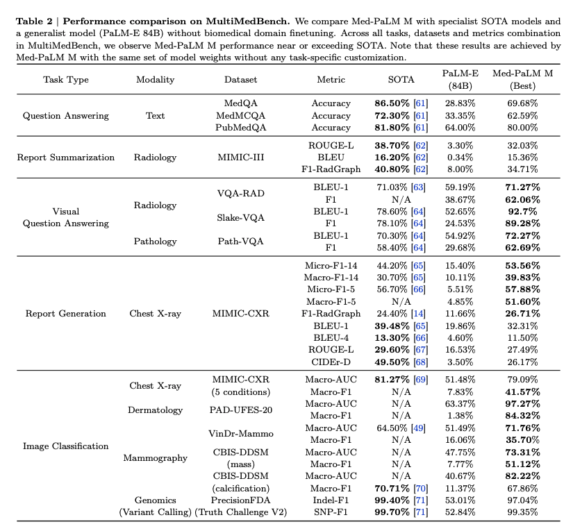

# Results

Here you can find the performance of various models on the MultiMedEval.

## Tasks

TODO: add an updated list of the tasks

### Question Answering

These tasks are text only.

| Dataset  | Modality | Size     |
| -------- | -------- | -------- |
| MedQA    | Text     | 1,273    |
| MedMCQA  | Text     | 4,183    |
| PubMedQA | Text     | 500      |

Benchmark:
| Model    | Mistral7B | MedAlpaca     | Llama 2       | RadFM      | PMC-LLama |
| -------- | --------- | ------------- | ------------- | ---------- | --------- |
| MedQA    | 0.307     | 0.338         | 0.301         | 0.214      | 0.472     |
| PubMedQA | 0.414     | 0.544         | 0.538         | 0.58       | 0.684     |
| MedMCQA  | 0.376     | 0.352         | 0.361         | 0.289      | 0.524     |

### Report Summarization

| Dataset   | Modality | Size     |
| --------- | -------- | -------- |
| MIMIC-III | CT & MRI | 13,057   |

### Visual Question Answering

| Dataset   | Modality                  | Size     |
| --------- | ------------------------- | -------- |
| VQA-RAD   | CT, MRI, and chest X-rays | 451      |
| Slake-VQA | CT, MRI, and chest X-rays | 2,070    |
| Path-VQA  | Pathology                 | 6,761    |

Benchmark:
| Model     | Metric | RadFM      |
| --------- | ------ | ---------- |
| VQA-RAD   | BLEU   | 0.535      |
|           | F1     | 0.548      |
| Slake-VQA | BLEU   | 0.742      |
|           | F1     | 0.750      |
| Path-VQA  | BLEU   | 0.240      |
|           | F1     | 0.243      |

### Report Generation

| Dataset  | Modality | Size     |
| -------- | -------- | -------- |
| MIMIC-CXR | Chest X-ray | 4,834 |

Benchmark:
| Model     | Metric | RadFM      |
| --------- | ------ | ---------- |
| MIMIC-CXR | BLEU-1 | 0.024      |
|           | BLEU-4 | 0.003      |
|           | F1-RadGraph | 0.062 |

{'bleu1': 0.024421775713562965, 'bleu4': 0.0035396283492445946, 'rougeL': {'rougeL_fmeasure': tensor(0.0950), 'rougeL_precision': tensor(0.2321), 'rougeL_recall': tensor(0.0714)}, 'f1-radgraph': 0.06279461085796356, 'CheXBert vector similarity': 0.21255505084991455, 'f1-bertscore': 0.06411987543106079, 'radcliq': 4.900036858132729, 'meteor': 0.08014929367567357}

### Medical Image Classification

| Dataset  | Modality | Size     |
| -------- | -------- | -------- |
| MIMIC-CXR    |  | Official |
| PAD-UFES-20  | Dermatology | 460 |
| VinDr-Mammo |  | 4,000 |
| CBIS-DDSM (mass) |  | 378 |
| CBIS-DDSM (calcification) |  | 326 |
| PrecisionFDA Truth Challenge V2 |  | 13,030 |